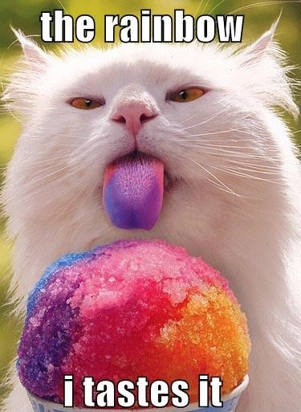

# lolr

[](https://crates.io/crates/lolr)
[](https://opensource.org/licenses/MIT)

This project is inspired by the original [lolcat](https://github.com/busyloop/lolcat) by busyloop. The cat image is from the original lolcat README. lolr extends the concept with native Rust implementation and animation support.

A Rust CLI that colorizes text with rainbow gradients, including animation support.



## Why lolr?

Existing Rust ports of lolcat lack the `-a` animation feature, which creates a dynamic, moving rainbow effect. **lolr** fills this gap by providing full animation support with multiple gradient presets, making it the most feature-complete Rust implementation of lolcat.

## Installation

```bash
cargo install lolr
```

## Usage

```bash
# Colorize stdin
echo "Hello, world!" | lolr

# Colorize files
lolr file.txt

# With animation
fortune | lolr -a

# Different gradient
cat README.md | lolr --gradient fire

# Multiple files
lolr file1.txt file2.txt

# Custom animation speed
echo "Animated text" | lolr -a --speed 30 --duration 20
```

## Options

| Flag | Long | Description | Default |
|------|------|-------------|---------|
| `-p` | `--spread` | Rainbow spread | 3.0 |
| `-F` | `--freq` | Rainbow frequency | 0.1 |
| `-S` | `--seed` | Color seed (0=random) | 0 |
| `-a` | `--animate` | Enable animation | off |
| `-d` | `--duration` | Animation frames | 12 |
| `-s` | `--speed` | Animation FPS | 20 |
| `-g` | `--gradient` | Gradient preset | rainbow |
| `-i` | `--invert` | Swap foreground/background | off |
| `-t` | `--truecolor` | Force 24-bit color | auto |
| `-f` | `--force` | Force color on non-TTY | off |

## Gradients

- `rainbow` - Classic sine-wave rainbow
- `fire` - Red → orange → yellow
- `ocean` - Blue → cyan → white
- `pastel` - Soft pastel rainbow
- `neon` - Vibrant high-saturation colors

## Library Usage

```rust
use lolr::{Gradient, RenderOpts, render_line};

let opts = RenderOpts {
    gradient: Gradient::Rainbow,
    spread: 3.0,
    freq: 0.1,
    truecolor: true,
    invert: false,
};

let colored = render_line("Hello, world!", 0.0, &opts);
println!("{}", colored);
```

### Animation

```rust
use lolr::{Gradient, AnimateOpts, animate};

let opts = AnimateOpts {
    gradient: Gradient::Fire,
    spread: 3.0,
    freq: 0.1,
    seed: 42.0,
    duration: 12,
    speed: 20.0,
    truecolor: true,
    invert: false,
};

animate("Animated text", &opts)?;
```

## License

MIT
