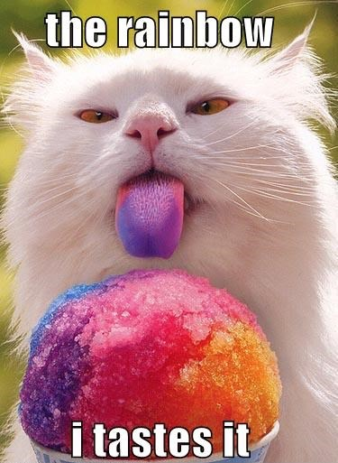

# lolr

[](https://crates.io/crates/lolr)
[](https://opensource.org/licenses/MIT)

A Rust implementation of [lolcat](https://github.com/busyloop/lolcat) with full `-a` animation support. Other Rust ports lack animation; lolr brings it back, plus adds multiple gradient presets.



*Cat image from the original lolcat by busyloop.*

## Installation

```bash
cargo install lolr
```

## Usage

```bash
# Colorize stdin
echo "Hello, world!" | lolr

# Colorize files
lolr file.txt

# With animation
fortune | lolr -a

# Different gradient
cat README.md | lolr --gradient fire

# Show available gradients
lolr --list-gradients

# Preview built-in gradients
lolr --preview

# Preview one configured palette
lolr --preview candy

# Multiple files
lolr file1.txt file2.txt

# One continuous color wave across files
lolr --continuous file1.txt file2.txt

# Named palette from the config file
lolr --palette candy file.txt

# Custom animation speed
echo "Animated text" | lolr -a --speed 30 --duration 20

# Reverse the animation and adjust for a light terminal theme
echo "Animated text" | lolr -a --direction reverse --background light

# Keep colors when redirecting output
echo "Hello, world!" | lolr --force > colored.txt

# Use fewer ANSI codes when saving colored output
lolr --force --compact file.txt > colored.txt
```

lolr colors output when stdout is a terminal. When stdout is redirected or
captured, it copies input unchanged unless `--force` is set. Animation needs a
terminal; `-a --force` colors redirected output without animation.
When coloring, lines containing invalid UTF-8 bytes pass through unchanged;
subsequent valid lines are still colored.
Set `NO_COLOR` to a nonempty value to suppress color by default; `--force` or
`force = true` in the config file overrides it on normal runs. `--preview`
bypasses config, so use `--preview --force` to color captured previews.

Animation processes input one line at a time. Lines too wide to redraw safely
are colored once, without animation. For repeated frames it prepares ANSI
controls and grapheme widths once per line. It checks terminal width between
frames and schedules frames against elapsed time.

Color positions follow displayed grapheme width for wide text, combining marks,
and joined emoji. `--compact` reuses color codes and resets at control
boundaries. It keeps the same visible colors but changes the exact ANSI bytes.

## Performance baseline

Run `cargo run --release --example bench_render` to measure the renderer on
ASCII and on a repeatable mix of text, ANSI styling, tabs, and Unicode, in both
truecolor and 256-color modes, including longer mixed lines, with fresh buffers,
reused output, and reused parser scratch buffers. It also measures dark and
light background contrast adjustment.

Run `cargo run --release --example bench_animation` to compare repeated rendering
with preparing each line once, including preparation cost, for 1, 2, 6, and 12
frames. This measures rendering work without animation sleeps or terminal I/O.
Compare results on the same machine and Rust toolchain before and after changes.

## Options

| Flag | Long | Description | Default |
|------|------|-------------|---------|
| | `--config PATH` | Use a specific config file | XDG path |
| | `--no-config` | Ignore config and skip creation | off |
| | `--print-config-path` | Print the resolved config path | off |
| `-p` | `--spread` | Rainbow spread | 3.0 |
| `-F` | `--freq` | Rainbow frequency | 0.1 |
| `-S` | `--seed` | Color seed (0=random) | 0 |
| `-a` | `--animate` | Enable animation | off |
| | `--no-animate` | Override configured animation | off |
| `-d` | `--duration` | Animation frames | 6 |
| `-s` | `--speed` | Animation FPS | 40 |
| `-g` | `--gradient` | Gradient preset | rainbow |
| | `--palette NAME` | Named palette from config | none |
| | `--background dark\|light` | Adjust contrast for an assumed background | off |
| | `--no-background` | Override configured contrast | off |
| | `--direction forward\|reverse` | Animation direction | forward |
| | `--list-gradients` | List gradient presets and exit | |
| | `--preview [NAME]` | Preview built-ins or one named palette and exit | |
| | `--compact` | Reuse ANSI color codes | off |
| | `--no-compact` | Override configured compact mode | off |
| | `--continuous` | Keep color position across files | off |
| | `--no-continuous` | Override configured continuous mode | off |
| `-i` | `--invert` | Swap foreground/background | off |
| | `--no-invert` | Override configured inversion | off |
| `-t` | `--truecolor` | Force 24-bit color | auto |
| | `--no-truecolor` | Disable forced and detected 24-bit color | off |
| `-f` | `--force` | Force color on non-TTY | off |
| | `--no-force` | Override configured forced color | off |

## Gradients

- `rainbow` - Classic sine-wave rainbow
- `fire` - Red → orange → yellow
- `ocean` - Blue → cyan → white
- `pastel` - Soft pastel rainbow
- `neon` - Vibrant high-saturation colors
- `sunset` - Purple → magenta → orange → gold
- `forest` - Deep green → emerald → lime
- `synthwave` - Violet → hot pink → electric blue
- `viridis` - Perceptually balanced purple → teal → yellow
- `aura` - Cool purple → blue → teal glow from the [Aura Theme](https://github.com/daltonmenezes/aura-theme)

## Configuration

lolr creates a configuration file atomically on first normal run. It resolves
the path in this order:

1. `--config PATH`
2. `$LOLR_CONFIG`
3. `$XDG_CONFIG_HOME/lolr/config.toml`
4. `~/.config/lolr/config.toml`

Run `lolr --print-config-path` to see the resolved path. `--help`, `--version`,
`--list-gradients`, `--preview`, and `--print-config-path` do not create the file. Use
`--no-config` to bypass loading and creation, including to recover from a broken
config.

The generated file contains the active defaults. Optional `palette` and
`background` settings are omitted until you add them:

```toml
spread = 3.0
freq = 0.1
seed = 0
animate = false
duration = 6
speed = 40.0
invert = false
truecolor = false
force = false
gradient = "rainbow"
continuous = false
compact = false
direction = "forward"
```

Add named palettes under `[palettes]`. Each palette needs 2 to 16 `#RRGGBB`
colors. Select one with `--palette NAME`, or set `palette = "NAME"` at the top
level. `--gradient` overrides a configured palette.

```toml
palette = "candy"

[palettes]
candy = ["#ff6b9d", "#b967ff", "#65d6ff"]
```

Set `background = "dark"` or `"light"` to adjust palette colors toward a
4.5:1 contrast ratio against assumed black or white. This is an explicit
approximation before 256-color conversion; lolr does not query your terminal
theme. Contrast adjustment applies to foreground colors and cannot be combined
with `--invert`.

Command-line options take precedence over config values. The `--no-animate`,
`--no-invert`, `--no-truecolor`, `--no-force`, `--no-background`,
`--no-continuous`, and `--no-compact` flags explicitly override
configured `true` values. Missing config keys retain their built-in defaults.
Unknown keys, invalid types, invalid ranges, and config files larger than 1 MiB
are rejected with the path and cause in the error. Existing files are never
rewritten by lolr.

lolr intentionally defaults to a shorter 40 FPS animation instead of lolcat's
12 frames at 20 FPS. Use `--duration 12 --speed 20` for the classic timing.

## Library Usage

```rust
use lolr::{Gradient, RenderOpts, render_line};

let opts = RenderOpts {
    gradient: Gradient::Rainbow,
    spread: 3.0,
    freq: 0.1,
    truecolor: true,
    invert: false,
};

let colored = render_line("Hello, world!", 0.0, &opts);
println!("{}", colored);
```

For streaming rendering, `Renderer::render_into` reuses ANSI/Unicode scratch
buffers as well as the supplied output buffer. Each call replaces the output
and starts fresh parsing and color state:

```rust
use lolr::{Renderer, RenderOpts, RenderStyle};

let opts = RenderOpts::default();
let style = RenderStyle::default();
let mut renderer = Renderer::default();
let mut output = Vec::new();
for (offset, line) in ["Hello", "world!"].iter().enumerate() {
    renderer.render_into(line, offset as f64, &opts, &style, &mut output);
    // Write output to your terminal or another destination here.
}
```

`render_line_styled_into` provides output-buffer reuse without retaining parser
scratch buffers. For repeated rendering of the same text, `PreparedLine` also
caches parsed controls and grapheme widths; colors are recomputed for each offset:

```rust
use lolr::{PreparedLine, RenderOpts, RenderStyle};

let line = PreparedLine::new("Hello 界 👩‍💻");
let mut output = Vec::new();
for frame in 0..6 {
    line.render_into(frame as f64, &RenderOpts::default(), &RenderStyle::default(), &mut output);
}
```

### Animation

```rust
use lolr::{Gradient, AnimateOpts, animate};

let opts = AnimateOpts {
    gradient: Gradient::Fire,
    spread: 3.0,
    freq: 0.1,
    seed: 42.0,
    duration: 12,
    speed: 20.0,
    truecolor: true,
    invert: false,
};

animate("Animated text", &opts)?;
```

## License

MIT
